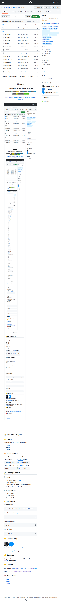

<div align="center">

  <h1>Genie</h1>  
  <p>
    Flexible github repository template for projects! 
  </p>

<!-- Badges -->
<p>
  <a href="https://github.com/natainditama/genie/graphs/contributors">
    
  </a>
  <a href="https://github.com/natainditama/genie/issues/">
    
  </a>
  <a href="https://github.com/natainditama/genie/network/members">
    
  </a>
  <a href="https://github.com/natainditama/genie/graphs/commit-activity">
    
  </a>
  <a href="https://github.com/natainditama/genie/stargazers">
    
  </a>
  <a href="https://github.com/natainditama/genie/blob/master/LICENSE">
    
  </a>
  <a href="https://github.com/natainditama/genie">
    
  </a>
</p>
   
  <h4>
    <a href="https://github.com/natainditama/genie/">View Demo</a>
    <span> · </span>
    <a href="https://github.com/natainditama/genie">Documentation</a>
    <span> · </span>
    <a href="https://github.com/natainditama/genie/issues/">Report Bug</a>
    <span> · </span>
    <a href="https://github.com/natainditama/genie/issues/">Request Feature</a>
  </h4>
</div>

<br />

<div align="center"> 
  
</div>

<br />

<!-- About the Project -->
## 📝 About the Project

<!-- Features -->
### 🌟 Features

This project includes the following features:

- Feature 1
- Feature 2
- Feature 3

<!-- Color Reference -->
### 🎨 Color Reference

| Color            | Hex                                                              |
| ---------------- | ---------------------------------------------------------------- |
| Primary Color    |  #222831 |
| Secondary Color  |  #393E46 |
| Background Color |  #00ADB5 |
| Text Color       |  #EEEEEE |

<!-- Getting Started -->
## 🚀 Getting Started

<!-- Usage -->
### 🔍 Usage

1. Create your repository [here](https://github.com/new?template_name=genie&template_owner=natainditama).
2. Clone your repository.
3. Update README.md with yourusername/repo.
4. Customize the project based on your needs.

<!-- Prerequisites -->
### 🔧 Prerequisites

- Prerequisite 1
- Prerequisite 2
- Prerequisite 3

<!-- Run Locally -->
### 🏃 Run Locally

Clone the project

```bash
  git clone https://github.com/natainditama/genie.git
```

Go to the project directory

```bash
  cd my-project
```

Install dependencies

```bash
  yarn
```

Start the server

```bash
  yarn start
```

<!-- Contributing -->
## 👋 Contributing

<a href="https://github.com/natainditama/genie/graphs/contributors">
  
</a><br/>

Contributions are always welcome!

See [contributing.md](https://github.com/natainditama/genie/blob/main/.github/CONTRIBUTING.md) for ways to get started.

<!-- License -->
## ⚠️ License

This project is licensed under the MIT License. See the [LICENSE](https://github.com/natainditama/genie/blob/main/LICENSE) file for details

<!-- Contact -->
## 🤝 Contact
Nata Inditama - [natainditama](https://linkedin.com/in/natainditama/) - natainditama.dev@gmail.com

Project Link: [https://github.com/natainditama/genie](https://github.com/natainditama/genie)

<!-- Resources -->
## 📚 Resources

- [Project 1](https://project/)
- [Project 2](https://project/)
- [Project 3](https://project/)
